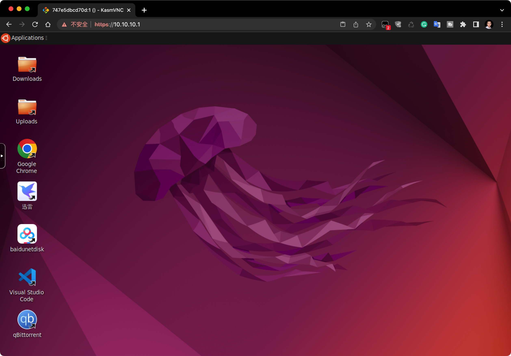

# ubuntu-desktop

基于[KasmWeb](https://www.kasmweb.com/)的 Ubuntu 22.04 桌面版（Web） Docker Image。镜像替换了阿里云Ubuntu Jammy镜像源，安装了Google Chrome浏览器和流行的文本编辑器VSCode。同时集成了qBittorren/迅雷/百度网盘国内流行的主流下载工具。

使用如下命令运行容器，即可得到一个纯净的Ubuntu 22.04桌面环境，通过任意浏览器访问 `https://your-host-ip` 即可。适合部署在Home Server或OpenWrt等软路由系统中，实现网络资源下载和私有网络服务访问。

```bash
# build
docker build -t colinchang/ubuntu-desktop .

# run
docker run -d \
    --name ubuntu \
    --shm-size=512m \
    -p 443:6901 \
    -e VNC_PW=password \
    -u root \
    --restart always \
    colinchang/ubuntu-desktop
```



注意通过浏览器访问时协议类型务必确认是`https`,
默认登录信息如下：
* 用户名：kasm_user
* 密码：password


用户可以根据需要挂载数据卷。